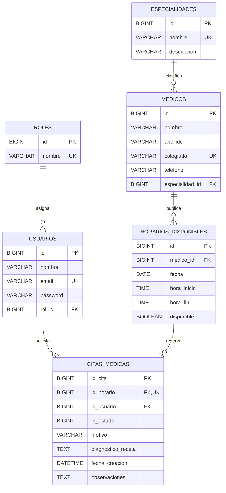

# Diagrama Entidad-Relación - Sistema de Citas Médicas

El siguiente diagrama representa el modelo activo utilizado por el backend en la Fase 1.

## Relaciones principales

- Un **rol** puede estar asignado a muchos usuarios.
- Una **especialidad** puede pertenecer a muchos médicos.
- Un **médico** puede publicar muchos horarios disponibles.
- Un **usuario** puede solicitar varias citas médicas.
- Un **horario disponible** puede quedar asociado como máximo a una cita; al reservarse, el backend lo marca como no disponible.

> Nota: en la implementación actual de `CitaMedica`, `idHorario`, `idUsuario` e `idEstado` se almacenan como identificadores numéricos. Las relaciones del diagrama muestran la asociación lógica utilizada por el sistema en esta fase.
